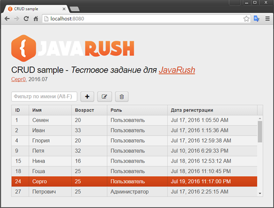

# CRUD sample
## Вступительное задание для [Java Online Projects](http://javaops.ru/) по курсу [JavaRush](https://javarush.ru/) </br>
Реализация простого [CRUD](https://ru.wikipedia.org/wiki/CRUD) Web приложения



### Использованные технологии
 - [Spring Boot](http://projects.spring.io/spring-boot/)
 - [Vaadin](https://vaadin.com)
 - [Spring Data JPA](http://projects.spring.io/spring-data-jpa/)
 
### За основу были взяты примеры
 - [Creating CRUD UI with Vaadin](https://spring.io/guides/gs/crud-with-vaadin/)
 - [Spring Data JPA CRUD with Vaadin](https://github.com/mstahv/spring-data-vaadin-crud#spring-data-jpa-crud-with-vaadin)
 - [Spring Boot Sample Data JPA](https://github.com/spring-projects/spring-boot/tree/master/spring-boot-samples/spring-boot-sample-data-jpa)
   
### Установка приложения
Установить на компьютер [JDK](http://www.oracle.com/technetwork/java/javase/downloads/jdk8-downloads-2133151.html), [Maven](https://maven.apache.org/), [Git](https://git-scm.com/) и [MySQL](http://dev.mysql.com/downloads/mysql/).</br>
В базе данных создать таблицу **user**:
```MySQL
 CREATE TABLE `user` (
   `id` int(8) NOT NULL AUTO_INCREMENT,
   `name` varchar(25) NOT NULL DEFAULT 'undefined',
   `age` int(11) NOT NULL DEFAULT '0',
   `isAdmin` bit(1) NOT NULL DEFAULT b'0',
   `createDate` timestamp NOT NULL DEFAULT CURRENT_TIMESTAMP ON UPDATE CURRENT_TIMESTAMP,
   PRIMARY KEY (`id`),
  KEY `date` (`createDate`)
 ) ENGINE=InnoDB DEFAULT CHARSET=utf8;
```
Параметры БД задать в системных переменных (System Environment):
```
DATASOURCE_URL - Адрес подключения к БД  
Пример:jdbc:mysql://localhost/test?reconnect=true&useUnicode=yes&characterEncoding=UTF-8&useSSL=false 
DATASOURCE_USERNAME - Логин к БД 
Пример: root
DATASOURCE_PASSWORD - Пароль к БД
Пример: root
```

### Запуск приложения
Выполнить в рабочей директории команды:
```
git clone https://github.com/Cepr0/crudsample.git
cd crudsample
mvn spring-boot:run
```
Открыть приложение в браузере по адресу: [http://localhost:8080/](http://localhost:8080/)

### Live demo
[http://crudsample.herokuapp.com/](http://crudsample.herokuapp.com/)
